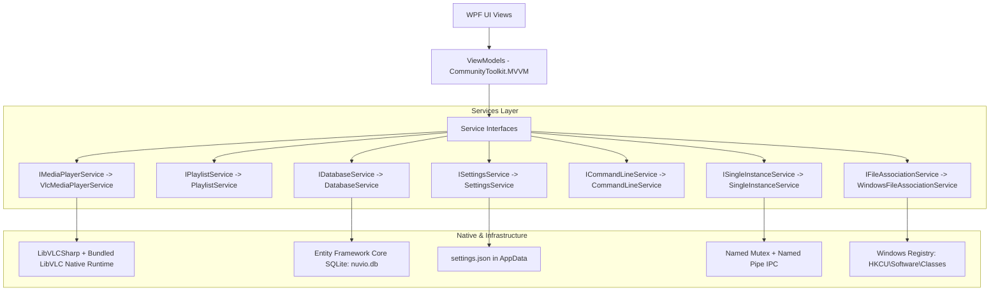

# Nuvio Player — Architecture & Technical Reference

Nuvio Player is engineered as a high-performance, commercial-grade Windows desktop media player using C# and .NET 8 (WPF) with modern MVVM principles, an isolated LibVLC native media engine, SQLite/EF Core persistence, and Windows operating system integration.

---

## 1. High-Level Architecture Overview



---

## 2. Project Structure

```
NuvioPlayer/
│
├── src/
│   ├── NuvioPlayer/                        # Main WPF Application
│   │   ├── App.xaml / App.xaml.cs          # DI Setup, Lifecycle, Mutex & IPC entry
│   │   ├── Configuration/                  # Settings JSON & schema
│   │   ├── Converters/                     # Value converters (TimeSpan, BoolToVis)
│   │   ├── Database/                       # EF Core DbContext & Migrations
│   │   │   ├── Entities/                   # History, Playlists, Bookmarks, Settings
│   │   │   └── NuvioDbContext.cs
│   │   ├── Helpers/                        # MediaFileHelper, RelayCommand, FileLogger
│   │   ├── Interfaces/                     # Service abstractions (IMediaPlayerService, etc.)
│   │   ├── Models/                         # Domain models (PlaylistItem, TrackItem, UserSettings)
│   │   ├── Resources/                      # Colors.xaml, Brushes.xaml, Icons.xaml, Styles.xaml
│   │   ├── Services/                       # Service implementations (Vlc, Database, etc.)
│   │   ├── ViewModels/                     # MainViewModel, PlaylistViewModel, SettingsViewModel
│   │   └── Views/                          # MainWindow, SettingsWindow, MediaInfoDialog
│   │
│   └── NuvioPlayer.Tests/                  # Comprehensive xUnit automated test suite
│       ├── MainViewModelTests.cs
│       ├── MediaPlayerServiceTests.cs
│       ├── PlaylistServiceTests.cs
│       ├── DatabaseServiceTests.cs
│       ├── SettingsServiceTests.cs
│       ├── SettingsViewModelTests.cs
│       ├── WindowsIntegrationTests.cs
│       ├── ResumePlaybackTests.cs
│       └── ConverterTests.cs
│
├── installer/
│   └── NuvioPlayer.iss                     # Inno Setup 6 packaging configuration
│
├── docs/
│   ├── ARCHITECTURE.md                     # Technical architecture (this document)
│   ├── QA_CHECKLIST.md                     # 40-item verification test matrix
│   ├── IMPLEMENTATION_PLAN.md              # Phase tracking and implementation details
│   └── ROADMAP.md                          # Version milestones (V1, V1.1, V2)
│
└── scripts/
    └── publish.ps1                         # Automated build, test, and release packaging
```

---

## 3. Core Architectural Subsystems

### 3.1 Media Engine Abstraction (`IMediaPlayerService`)
- Direct low-level LibVLC types (`LibVLC`, `MediaPlayer`, `Media`) are strictly encapsulated behind `IMediaPlayerService` and `VlcMediaPlayerService`.
- **Playback Control:** Play, Pause, Stop, SeekTo, SeekRelative, SetVolume, SetMute, SetPlaybackRate, SetAspectRatio.
- **Track Management:** Dynamically inspects media tracks (Audio, Subtitle, Video) and exposes them through immutable domain items (`MediaTrackInfo`, `TrackItem`).
- **Surface Rendering:** Exposes native player instance for high-speed hardware-accelerated Direct3D11 rendering into WPF `vlc:VideoView`.
- **Disposal Safety:** Cleanly disposes previous `Media` and native handles when changing files to prevent memory leaks during prolonged sessions.

### 3.2 MVVM Presentation Layer
- Built with `CommunityToolkit.Mvvm`:
  - `MainViewModel`: Orchestrates playback state, time formatting, floating HUD visibility timers, OSD messages, and right sidebar tab state.
  - `PlaylistViewModel`: Manages queue ordering, shuffle (Fisher-Yates), repeat modes (`None`, `All`, `One`), and M3U/M3U8 import/export.
  - `SettingsViewModel`: Provides an interactive 9-category preferences dashboard with validation and live state persistence.
- Views contain **zero business logic**; all user gestures and shortcuts route through strongly-typed commands.

### 3.3 Database & State Persistence (`IDatabaseService`)
- Backed by **SQLite** using **Entity Framework Core 8**.
- Database location: `%APPDATA%\NuvioPlayer\nuvio.db`.
- Tables:
  - `MediaHistory`: Records file paths, display titles, last playback position in milliseconds, duration, last played timestamp, and play counts.
  - `Playlists` & `PlaylistItems`: Stores named playlists and persistent sort order.
  - `Bookmarks`: Stores timestamped media bookmarks with user labels.
- `DatabaseService` handles automatic schema creation and non-destructive updates.

### 3.4 Single-Instance & IPC Pipeline (`ISingleInstanceService`)
- Uses a local named `Mutex` (`Local\NuvioPlayer_SingleInstance_Mutex`).
- If another instance is running:
  1. The new process connects to an asynchronous local Named Pipe (`NuvioPlayer_IPC_Pipe`).
  2. Writes the command-line arguments as JSON.
  3. Exits immediately (`Shutdown(0)`).
- The primary instance's background pipe listener receives the arguments, restores and activates the `MainWindow`, and forwards the media files to `MainViewModel.HandleMediaPathsAsync`.

### 3.5 Windows Integration & File Associations (`IFileAssociationService`)
- Manages per-user file associations under `HKEY_CURRENT_USER\Software\Classes` without requiring administrative UAC elevation.
- Associates `.mp4`, `.mkv`, `.avi`, `.mov`, `.webm`, `.mpeg`, `.mpg`, `.ts`, `.m2ts`, `.flv`, `.wmv` to `NuvioPlayer.AssocFile.<ext>`.
- Calls Win32 `SHChangeNotify(SHCNE_ASSOCCHANGED)` to immediately refresh the Windows Explorer icon cache and context menus.

### 3.6 Centralized Design & Theme System
- All styles, vector geometry icons, colors, and brushes are declared in merged ResourceDictionaries:
  - `Colors.xaml`: Restrained modern dark palette with vibrant Nuvio Sky Blue accent (`#38BDF8`).
  - `Brushes.xaml`: Solid color brushes for surfaces, borders, text tiers, HUD overlays, and semantic status colors.
  - `Icons.xaml`: Clean vector SVG/Path geometries.
  - `Styles.xaml`: Reusable modern controls (buttons, textboxes, sliders, scrollbars, listboxes).

---

## 4. Lifecycle and Resource Management

1. **Startup (`App.xaml.cs`):**
   - Single-instance mutex check.
   - Dependency injection container creation.
   - Structured logging initialization (`%APPDATA%\NuvioPlayer\logs\nuvio.log`).
   - Asynchronous settings and database loading.
   - `MainWindow` presentation.
   - Initial CLI arguments processing.
2. **Shutdown:**
   - Active playback position recorded to SQLite history.
   - Settings asynchronously persisted to disk.
   - Single-instance mutex and IPC pipe listener released.
   - LibVLC media player and rendering resources disposed.
